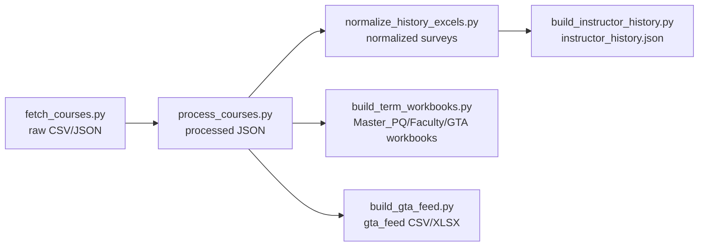

# SharePoint Drop Folder (Exports)

This folder is ready to drag/drop into SharePoint. Each term has its own subfolder:

- `Master_PQ.xlsx` — read-only source for Power Query:
  - Sheet `GTA Eligible` (locked) with Term/CRN/Course/Sec/Title/.../Total Enr. TA prefs empty. Protect this sheet.
  - Sheet `Time Conflicts`.
- `Faculty_Preferences.xlsx` — faculty-facing master with edits:
  - `GTA Eligible` (same as Master_PQ).
  - `User Edits`: columns A–P (Term through Total Enr) locked/pulled by CRN from `GTA Eligible`; columns after P (In Class, Office Hours, Grading, Time commitment, Notes) are unlocked for faculty edits. Protect this sheet.
  - `Time Conflicts`.
  - `Faculty Preferences` names row from the template.
- `GTA_Editable.xlsx` — GTA-facing editable file (no Prefer TA columns; In Class/Office Hours/Grading/Time commitment/Notes unlocked).
- `gta_feed_<term>.csv/.xlsx` — GTA feed (same columns as GTA_Editable).

## Refresh workflow (local)
1) Scrape and process:
   - `python scripts/fetch_courses.py <term> ALL COMP data/course_COMP_<term>.csv`
   - `python scripts/process_courses.py data/course_COMP_*.json --outdir data/processed --combine data/processed/course_all_processed.json`
2) Normalize survey files:
   - Drop updated surveys into `data/history/excel/`.
   - `python scripts/normalize_history_excels.py --input-dir data/history/excel --output-dir data/history/normalized`
   - `python scripts/build_instructor_history.py --input-dir data/history/normalized --output data/history/instructor_history.json`
   - (Optional) `python scripts/build_course_instructor_history.py --courses data/processed/course_all_processed.json --history data/history/instructor_history.json --history-dir data/history/normalized --output data/processed/course_instructor_history.json`
3) Rebuild term workbooks and feeds:
   - `python scripts/build_term_workbooks.py <term>` (writes Master_PQ.xlsx, Faculty_Preferences.xlsx, GTA_Editable.xlsx into `data/exports/<term>/`)
   - `python scripts/build_gta_feed.py <term>` (writes gta_feed_<term>.csv/.xlsx into `data/exports/<term>/`)

## Power Query setup (SharePoint)
1) Upload the term folder(s) under one SharePoint library.
2) In Excel (Master):
   - Data → Get Data → From File → From SharePoint Folder → pick `Master_PQ.xlsx` → load `GTA Eligible` table; protect the sheet.
3) In Faculty workbook:
   - PQ to `Master_PQ.xlsx` `GTA Eligible` for read-only columns.
   - Use XLOOKUP/PQ merge with `User Edits` keyed on CRN; leave unlocked columns for faculty input.
4) In GTA workbook:
   - PQ to `gta_feed_<term>.csv`/`.xlsx` (or `GTA_Editable.xlsx`).
5) Lock PQ sheets; only unlocked columns in `User Edits`/GTA_Editable should be editable.

## Power Automate (optional)
- To publish GTA feeds from a private library: Flow reads `Faculty_Preferences.xlsx` (or `Master_PQ.xlsx`), trims to GTA columns, writes/overwrites `gta_feed_<term>.csv/.xlsx` in a GTA-accessible library. PQ in the GTA workbook points to that feed.

## Notes
- Column security comes from separate files + SharePoint permissions. Hidden columns are not secure.
- Term codes come from `config.py`; update there and rerun the steps for new terms.

## Diagrams

Local refresh pipeline:


Workbook relationships (per term):
```mermaid
flowchart LR
    MPQ[Master_PQ.xlsx<br/>GTA Eligible + Time Conflicts] -->|PQ link| FP[Faculty_Preferences.xlsx<br/>User Edits (A–P locked, rest editable)]
    MPQ -->|PQ link| GA[GTA_Editable.xlsx<br/>editable fields only]
    GA -->|identical columns| GF[gta_feed_<term>.csv/.xlsx]
```
